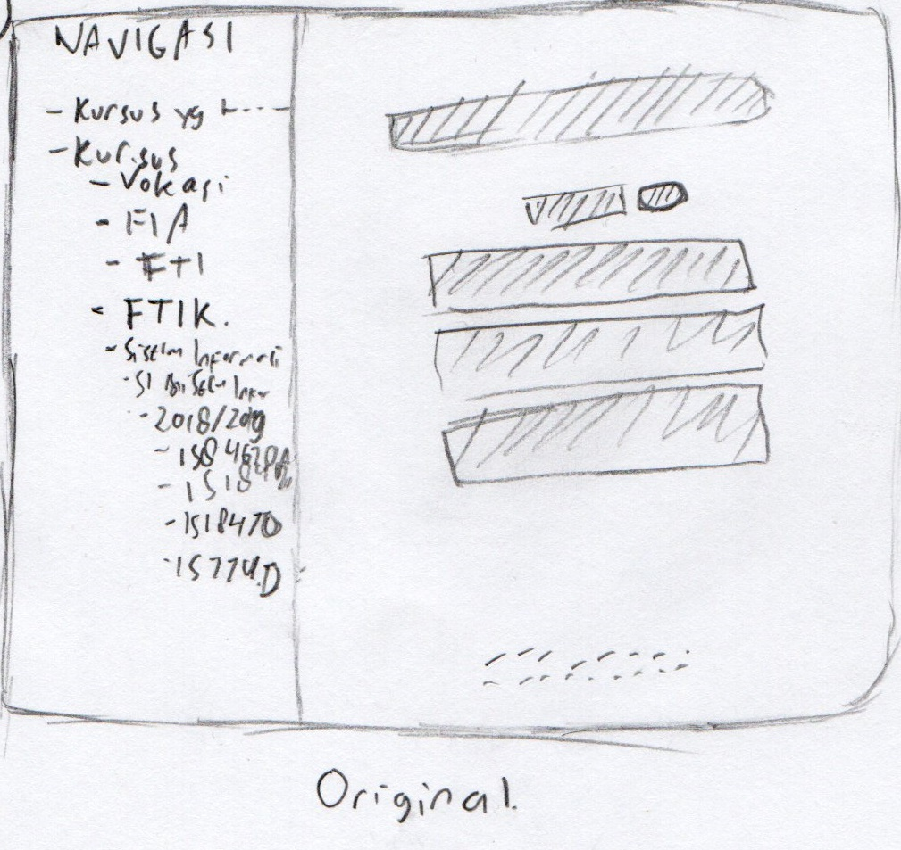
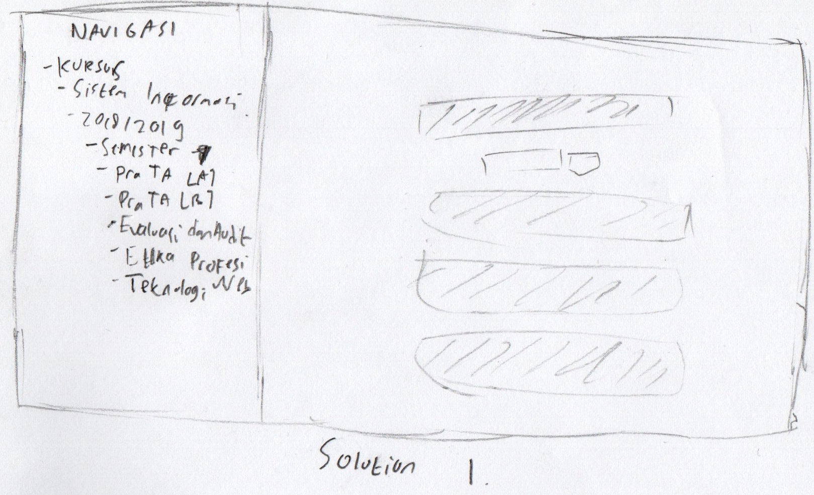
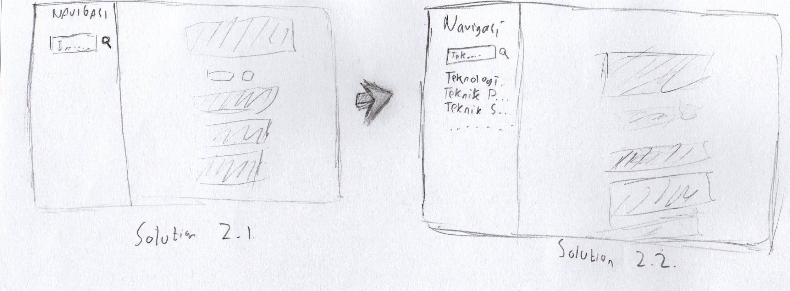
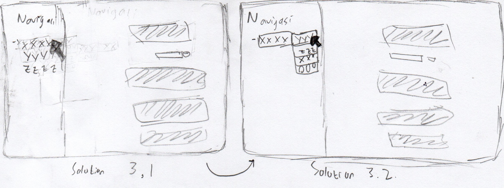

# Sketching and Prototyping
Using the information in the results of Assignment 1 for what is good and bad about the UI for designed tasks, we are going to make **Sketches** and **Prototypes**. These sketches and prototypes will lead to better design in Assignment 3. The prototypes will be then tested through a usability evaluation followed by design revision in Assignment 4.

## Part A: Sketches
Sketch at least **3 (three)** different UIs for the functions you are targeting. These three interfaces should be _dramatically different_ in terms of design directions. For example, they can be with different organizations of what functions on each screen or using a different layout of the icons, widgets, and menus on the screens. If you want, you can also incorporate non-on-screen UIs: physical buttons, gestures through motion sensors, etc.

You need **not** sketch the whole interface. It is not necessary for the sketches to have every function or every function in detail, but there should be enough to show off your general idea. **Be creative!** Draw your idea and label a few of the widgets so we can tell your intent. The goal is to have at least 3 good UIs in *interesting* ways. Sketches should be done on paper with pens and/or pencils (do not use a computer).

### 1. Scan/Photo of Sketches

### 2. Version Differences
#### Original
The original one has less intuitive label which says something like "IS847260A" which is **meaningless** for new user. Not only meaningless, **user has to remember** what is their course's code so they will land in the correct page. Othwerwise, they have to perform **exhaustive search** between all available course until they found the correct one.
#### Solution 1
In the first solution, i proposed to change the label into the **course's name**. For example, the label "IS847260A" should be changed to "Pra TA [A]". This way, user can effectively know which course do they need.
#### Solution 2
In the second solution, i proposed to change the whole navigation into a **live search navigation** which user has to partially type the course's name so the system can suggest which class they are looking for. For example, if user started to type "**Tek**" system should show 3 or more possible result like "**Tek**nologi Bergerak", "**Tek**nik Peramalan" dan "**Tek**nik Pemodelan". This way user can quickly find their desired result.
#### Solution 3
The third solution is actually an improvement of the first solution, i proposed to change the dropdown naviation into **PopUp Dropdown Navigation**. I also suggest to change the label into course's name. This way it won't feel encrumbed. For Example, if user started to hover on "XXXX" label, a popup will show and show user its content.

### 3. Selected Sketch
Given three possible solution, i will go with the **second solution** because a live search will save user's time and provide optimal result for the user. It will also prevent user from performing exhaustive search by having to open any drop down.

### 4. Design Rationale
Based on my last contextual inquiry, i noticed something very important. **If user takes a lot of time to get to what they want then it's a bad design**. User should be able to quickly find what they're looking for. Exhaustive search is an example of bad design. That's why i decided to choose the second solution if it's possible to be implemented for the website.

## Part B: Assumptions
### 1. Hardware
Operating System : Windows
Physical Input : Mouse and Keyboard
Screen Size : 15.6 inch
Screen Resolution : Min (1366 x 768) or higher with screen ration of 16:9
Screen Color Space : RGB

### 2. Users
The user is expected to be familiar with desktop computers which means they can use mouse and keyboards well enough. The user is also expected to be familiar with modern web browser such as Mozilla Firefox and Google Chrome. The user is expected to be a atleast 18 years old so they has enough experience using computers.

## Part C: Prototypes
We will work on this part together during the class on **March 22nd, 2019**, 10:00 AM - 12.30 PM. Therefore, prior to the class please complete all the above parts (A & B) beforehand accordingly.
